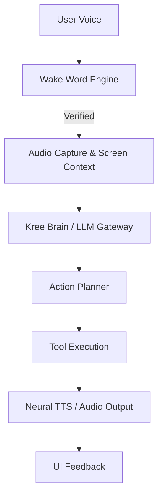

# Kree AI — Codebase Guide

Welcome to the Kree AI codebase! This guide is designed to help new contributors quickly understand the structure, architecture, and core components of Kree. 

---

## 1. Overview

Kree AI is an agentic, voice-driven assistant built specifically for Windows. It provides a local-first, privacy-respecting platform that integrates advanced reasoning (via cloud or local LLMs) with deep operating system control.

### Core Goals
*   **Local-First Privacy**: Sensitives like API keys, memories, and configurations are stored locally and encrypted.
*   **Voice Control**: Continuous wake-word detection allows hands-free interaction.
*   **Agentic Action**: Instead of just answering questions, Kree uses Playwright and OS APIs to execute tasks (e.g., managing files, searching the web, or controlling desktop apps).
*   **Hybrid Intelligence**: A routing system automatically switches between high-performance cloud models (Gemini) and local, air-gapped models (Ollama/Vosk).

### Entry Point & Boot Flow
1.  **`main.py`**: The wrapper script. It checks if the Edge WebView2 runtime is installed, runs pre-flight diagnostics, and handles crash logging to `%LOCALAPPDATA%\Kree\logs\crash.log`.
2.  **`kree/main_entry.py`**: The system orchestrator. It ensures single-instance execution via a Windows mutex, configures UTF-8 stream wrapping to prevent emoji crash issues, and boots the main `pywebview` interface.

---

## 2. Architecture

Kree operates on an asynchronous event loop that coordinates user voice input, brain reasoning, tool execution, and visual feedback.

### Voice-to-Response Loop


### Threading Model
Kree separates tasks across three main execution contexts to keep the interface highly responsive:
1.  **UI Thread**: Runs the `pywebview` window, rendering the frontend (HTML/JS/CSS).
2.  **Orchestrator Loop (Asyncio)**: Runs the background event loop in `main_entry.py` to handle WebRTC audio streams, WebSocket connections for the mobile bridge, and incoming agent tasks.
3.  **Worker Threads**: Blocking operations (like long-running Playwright web automation or local LLM inference) are offloaded to a thread pool executor.

---

## 3. Component Explanations

The codebase is organized into modular packages under the `kree/` directory:

```text
E:\Kree-v1-main\kree
├── actions/          # OS, Browser, and File controllers (the "hands")
├── agent/            # Cognitive planning and task execution (the "brain")
├── core/             # System-level services, security, and runtime (the "spine")
├── memory/           # Persistent JSON storage and preferences
├── main_entry.py     # Application orchestrator
├── mobile_bridge.py  # WebSocket server for PWA companion
├── serve_pwa.py      # Local server hosting the mobile PWA
└── ui.py             # PyWebView interface wrapper
```

### Key Components & Examples

#### `kree/core/vault.py` (Security & Encryption)
Manages the secure storage of API keys and credentials. On Windows, it uses **DPAPI** (Data Protection API), which ties encryption to the logged-in Windows user. If DPAPI is unavailable (e.g., during testing on non-Windows environments), it gracefully falls back to **Fernet** (symmetric encryption).
*   *Concrete Example*: Saving and loading the Gemini API key.
    ```python
    from pathlib import Path
    from kree.core import vault

    api_key_path = Path("config/api_keys.json")
    # Encrypts and saves key securely
    vault.save_api_key(api_key_path, "AIzaSy...")
    
    # Decrypts and retrieves key at runtime
    decrypted_key = vault.load_api_key(api_key_path)
    ```

#### `kree/core/llm_gateway.py` (Intelligence Router)
Acts as the central router for LLM requests. It inspects the user's `intelligence_mode` setting (Cloud Gemini vs Local Ollama) and routes queries accordingly.
*   *Concrete Example*: Switching to local mode when offline.
    ```python
    # If the gateway detects a network failure or a user toggle, 
    # it switches the LLM provider from Gemini Live to local Ollama.
    ```

#### `kree/actions/browser_control.py` (Web Automation)
Powered by Playwright, this module allows Kree to control a browser. It automatically detects the system's default browser (Chrome, Edge, Brave, etc.) so that it can run with the user's existing profile and cookies.
*   *Concrete Example*: Taking a screenshot or searching a webpage.
    ```python
    # Inside browser_control.py, Playwright launches the browser:
    # browser = playwright.chromium.launch(headless=False, executable_path=detected_path)
    ```

#### `kree/agent/planner.py` (Cognitive Planner)
Breaks down complex user requests into a list of sequential steps (a plan), passes them to `executor.py`, and tracks progress using `task_queue.py`.
*   *Concrete Example*: "Find the latest news on SpaceX and save it in a text file on my Desktop."
    *   *Step 1*: Call `browser_control.py` to search Google.
    *   *Step 2*: Scrape the top article text.
    *   *Step 3*: Call `file_controller.py` to write the text file.

#### `kree/memory/memory_manager.py` (Long-Term Memory)
Manages a local, encrypted JSON database containing facts Kree has learned about the user, past conversation summaries, and preferences.
*   *Concrete Example*: Injecting context into the LLM prompt.
    ```python
    # The memory manager retrieves facts like "User prefers Python over JavaScript".
    # This fact is appended to the system instructions before sending the prompt.
    ```

---

## 4. Troubleshooting

Here are common issues new contributors might face and how to resolve them:

### 1. WebView2 Runtime Errors
*   **Symptom**: The application window fails to open, or a blank window appears with a console error.
*   **Cause**: The Microsoft Edge WebView2 runtime is missing or corrupted.
*   **Resolution**: 
    1. Run diagnostics to check status:
       ```bash
       python main.py --diagnostics
       ```
    2. If the check fails, download and install the **WebView2 Runtime Evergreen Standalone Installer** from Microsoft's official website.

### 2. PyAudio / Microphone Failures
*   **Symptom**: Wake word does not trigger, or logs show `OSError: No Input Devices Found`.
*   **Cause**: PyAudio cannot access a recording device, or the default Windows recording device is inactive.
*   **Resolution**:
    1. Ensure your microphone is plugged in and set as the "Default Device" in Windows Sound Settings.
    2. Run the audio probe script to verify device visibility:
       ```bash
       python test_pyaudio_probe.py
       ```

### 3. DPAPI / Vault Failures in Tests
*   **Symptom**: Unit tests fail when trying to decrypt or encrypt configuration files.
*   **Cause**: DPAPI requires Windows credentials and fails if run in certain isolated CI/CD environments or non-Windows machines.
*   **Resolution**: The system automatically falls back to Fernet. Ensure your local testing environment has write access to the `config/` directory.

### 4. UnicodeEncodeError in Console
*   **Symptom**: The terminal crashes with a traceback pointing to a `print()` statement containing an emoji.
*   **Cause**: The Windows console (`cmd.exe` or PowerShell) is using `cp1252` encoding instead of `UTF-8`.
*   **Resolution**: 
    Kree wraps standard streams, but if you are running custom scripts, force UTF-8 in your terminal before running the app:
    ```powershell
    [Console]::OutputEncoding = [System.Text.Encoding]::UTF8
    ```
